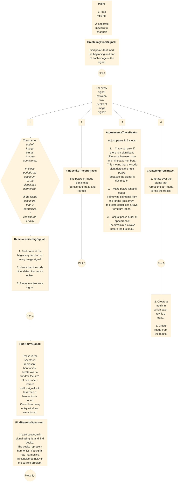

# VoyagerGoldenDisk

Plot 1: Detect peaks that represent the beginning and end of the image

Plot 2: Remove noise from the image signal.

Plot 3: Spectrum of a noisy signal window

Plot 4: Spectrum of a good window

